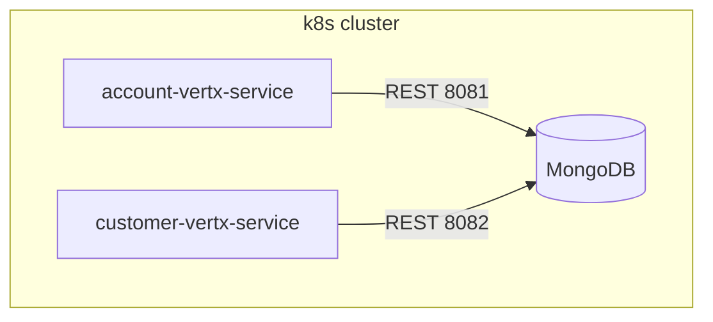

## Running Vert.x Microservices on Kubernetes/OpenShift [](https://twitter.com/piotr_minkowski)

[](https://circleci.com/gh/piomin/sample-vertx-kubernetes)

[](https://sonarcloud.io/dashboard?id=piomin_sample-vertx-kubernetes)
[](https://sonarcloud.io/dashboard?id=piomin_sample-vertx-kubernetes)
[](https://sonarcloud.io/dashboard?id=piomin_sample-vertx-kubernetes)
[](https://sonarcloud.io/dashboard?id=piomin_sample-vertx-kubernetes)

Detailed description can be found here: [Running Vert.x Microservices on Kubernetes/OpenShift](https://piotrminkowski.com/2018/03/20/running-vert-x-microservices-on-kubernetes-openshift/)

A demo showing two independent Vert.x 4 micro-services (**Account** and **Customer**) communicating with a shared MongoDB instance and ready for local or Kubernetes development with Skaffold.

## 1. Architecture



Both services expose JSON/HTTP endpoints and use reactive MongoDB clients.

## 2. Project structure

Path | Purpose
---- | -------
`account-vertx-service/` | Reactive account service (Vert.x 4)
`customer-vertx-service/` | Reactive customer service (Vert.x 4)
`k8s/` | Cluster-level manifests (MongoDB)
`*/k8s/` | Deployment & Service manifests per micro-service
`skaffold.yaml` | Continuous build/deploy loop
`renovate.json` | Dependency-update bot config

## 3. Prerequisites

* Java 17+
* Maven 3.8+
* Docker 20+
* `kubectl`
* Skaffold v2+
* A Kubernetes cluster (Minikube, Kind, Docker Desktop…)
* MongoDB 4.4+ running locally or accessible via environment variables:

  ```bash
  export MONGO_HOST=localhost
  export MONGO_PORT=27017
  export MONGO_DB=demo
  ```

## 4. Build & Run locally

```bash
mvn clean verify

# Account service
cd account-vertx-service
mvn vertx:run   # Service on http://localhost:8081/account

# Customer service
cd ../customer-vertx-service
mvn vertx:run   # Service on http://localhost:8082/customer
```

## 5. Container images

```bash
docker build -t account-vertx-service ./account-vertx-service
docker build -t customer-vertx-service ./customer-vertx-service
```

## 6. Running on Kubernetes with Skaffold

```bash
skaffold dev --port-forward
```

Skaffold will build and deploy manifests, then forward ports:

Service  | Local port
-------- | ----------
Account  | 8081
Customer | 8082

Stop with **Ctrl+C** to auto-clean; or run `skaffold delete`.

## 7. API reference

### Account service

Method | Path                        | Description
------ | --------------------------- | -----------
GET    | `/account/:id`              | Fetch account by ID
GET    | `/account/customer/:custId` | List accounts for a customer
GET    | `/account`                  | List all accounts
POST   | `/account`                  | Create new account (JSON)
DELETE | `/account/:id`              | Delete account by ID

### Customer service

Method | Path                       | Description
------ | -------------------------- | -----------
GET    | `/customer/:id`            | Fetch customer by ID
GET    | `/customer/name/:name`     | Find customer by name
GET    | `/customer`                | List all customers
POST   | `/customer`                | Create new customer (JSON)
DELETE | `/customer/:id`            | Delete customer by ID

## 8. Sample usage

```bash
# create a customer
curl -X POST localhost:8082/customer \
     -H "Content-Type: application/json" \
     -d '{"name":"Alice","surname":"Doe"}'

# list customers
curl localhost:8082/customer

# create an account for customer ID 1
curl -X POST localhost:8081/account \
     -H "Content-Type: application/json" \
     -d '{"number":"123","customer":1,"balance":1000}'

# list accounts for customer ID 1
curl localhost:8081/account/customer/1
```

## 9. Cleanup

```bash
skaffold delete
```

## Contributing

Contributions are welcome! Please open an issue to discuss your proposal, then submit a pull request. Fork the repository, create a feature branch, ensure all tests pass, and follow the existing coding conventions.

---

© 2025 — MIT License
